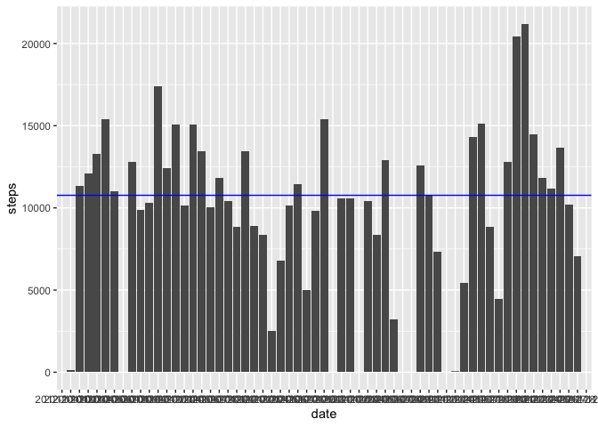
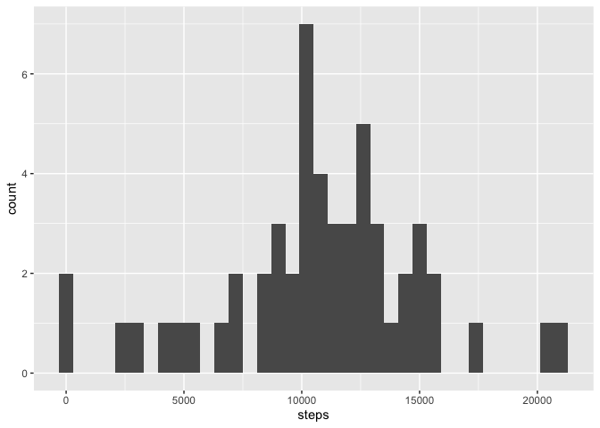
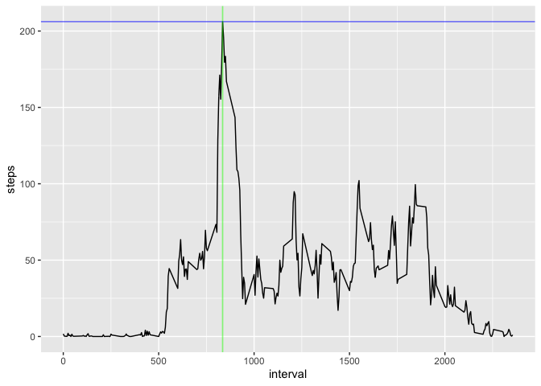
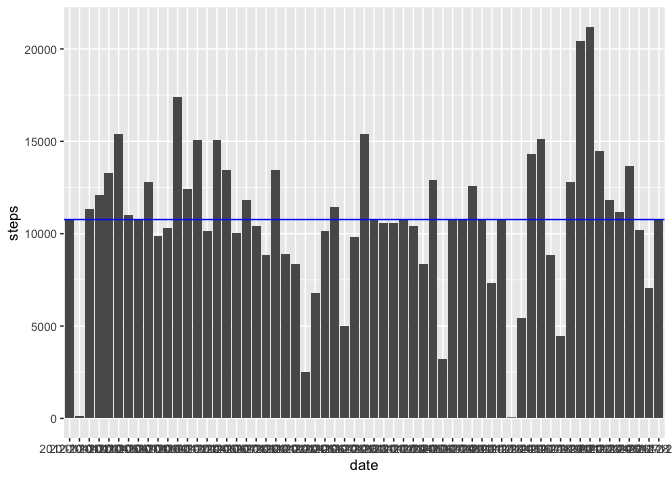
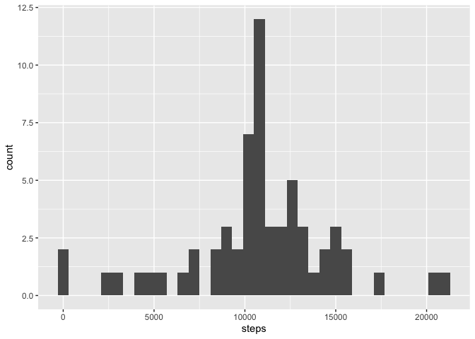
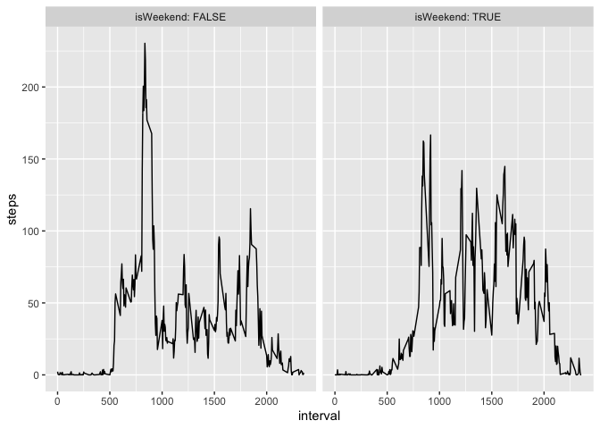

## Loading and pre-processing the data
First step is to download the raw data using the link. Then use the function to download and unzip the file and place it in the folder.

### 1. Load Data

```r
library(dplyr)
```

```

Attaching package: 'dplyr'
```

```
The following objects are masked from 'package:stats':

    filter, lag
```

```
The following objects are masked from 'package:base':

    intersect, setdiff, setequal, union
```

```r
library(ggplot2)
library(knitr)

if(!file.exists("data.zip")){
  fileUrl <- "https://d396qusza40orc.cloudfront.net/repdata%2Fdata%2Factivity.zip"
  download.file(fileUrl, destfile = "data.zip", method = "curl")
}
unzip("data.zip")
```
Then we need to read the CSV table

```r
## READ TABLE
data<- read.csv("activity.csv", header = TRUE)
```

## 2. What is mean total number of steps taken per day?
In this step we calculate the mean and the median removing the NAs from the dataset.
Also the dplyr package is used to group the data.

```r
steps_sum <- data%>% group_by(date) %>% summarise(sum(steps))
names(steps_sum)[2] <- "steps"
steps_avg <- mean(steps_sum$steps, na.rm = TRUE) #This is the mean
steps_median <- median(steps_sum$steps, na.rm = TRUE) # This is the median

g <- ggplot(data = steps_sum, aes(x = date, y = steps)) 
g <- g + geom_bar(stat = "identity") + geom_hline(yintercept = steps_avg, color = "blue")
g
```

<!-- -->

```r
ggplot(steps_sum, aes(steps)) + geom_histogram(binwidth = 600)
```

<!-- -->

We can see now the mean and the median of the total number of steps taken per day.


```r
steps_avg
steps_median
```

```
[1] 10766.19
[1] 10765
```


## 2. What is the average daily activity pattern?
Here we calculate the groups per intervals and get the maximum value.


```r
dat <- data
dat <- dat %>% group_by(interval) %>% summarise(mean(steps, na.rm = TRUE))
names(dat)[2] <- "steps"
stepmaxindex <- which.max(dat$steps)
maxstep <- dat$steps[stepmaxindex]
maxinterval <- dat$interval[stepmaxindex]

g <- ggplot(dat, aes(x = interval, y = steps)) + geom_line()
g <- g + geom_hline(yintercept = maxstep, col = "blue", lwd = 0.6, alpha = 0.5)
g <- g + geom_vline(xintercept = maxinterval, col = "green", lwd = 0.6, alpha = 0.5)
g
```

<!-- -->


```r
maxstep
maxinterval
```

```
[1] 206.1698
[1] 835
```

## 3. Imputing missing values

For imputing the missing values we used the previous table with average steps per interval and populate the NAs with these values.


```r
data1 <- data
NA_count <- 0
NA_rows <- c()
st <- data$steps
len <- length(st)
for(i in 1:len){
  if(is.na(st[i])){
    NA_count <- NA_count + 1
    NA_rows <- c(NA_rows,i)
    replacer <- as.numeric(dat[dat$interval == data$interval[i],2])
    data1$steps[i] <-  replacer
  }
}

steps_sum1 <- data1%>% group_by(date) %>% summarise(sum(steps))
names(steps_sum1)[2] <- "steps"
steps_avg1 <- mean(steps_sum1$steps, na.rm = TRUE) #This is the mean
steps_median1 <- median(steps_sum1$steps, na.rm = TRUE) # This is the median

g <- ggplot(data = steps_sum1, aes(x = date, y = steps)) 
g <- g + geom_bar(stat = "identity") + geom_hline(yintercept = steps_avg1, color = "blue")
g
```

<!-- -->

```r
ggplot(steps_sum1, aes(steps)) + geom_histogram(binwidth = 600)
```

<!-- -->

```r
steps_avg1
steps_median1
```

```
[1] 10766.19
[1] 10766.19
```


## 4. Are there differences in activity patterns between weekdays and weekends?

In this step we split beetween weekdays and weekend days, by creating a function.
Then we calculate the average per weekday and weekend.


```r
data2 <- data1
data2$date <- as.Date(data2$date, format = "%Y-%m-%d")

weekend <- function(date){
  if(weekdays(date) == "Sunday" | weekdays(date) == "Saturday")
    return(T)
  else return(F)
}

isWeekend <- sapply(data2$date, weekend)
data2 <-  cbind(data2, isWeekend)
data2 <- data2 %>% group_by(interval, isWeekend) %>% summarise(steps = mean(steps))
#head(data2)
kable(head(data2), caption = "Head of Weekday vs Weekend Data")

avgWd <- mean(data2[data2$isWeekend == TRUE,3]$steps)
avgWe <- mean(data2[data2$isWeekend == FALSE,3]$steps)
avgtable <- data.frame(WorkingDays = avgWd, Weekends = avgWe)
#avgtable


kable(avgtable, caption = "Average Table")

isWeekend.labs <- c("Working Day", "Weekend")
names(isWeekend.labs) <- c("Working day", "Weekend")
g <- ggplot(data = data2, aes(x = interval, y = steps)) + geom_line() + facet_grid(.~ isWeekend, labeller = label_both)
g
```

<!-- -->

Table: Head of Weekday vs Weekend Data

 interval  isWeekend        steps
---------  ----------  ----------
        0  FALSE        2.2511530
        0  TRUE         0.2146226
        5  FALSE        0.4452830
        5  TRUE         0.0424528
       10  FALSE        0.1731656
       10  TRUE         0.0165094


Table: Average Table

 WorkingDays   Weekends
------------  ---------
     42.3664   35.61058
